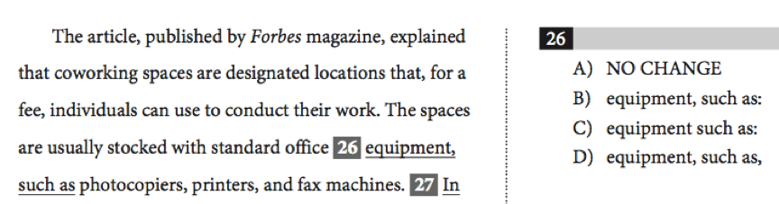

Checkpoint 3 SAT语法中的标点使用
====
刚刚看过了基础句子结构，现在我们一起来看看句子构成的另一个关键成分——标点，在这里我们主要展示4个意义型标点在SAT考试中的使用标准，同时在最后做一些拓展，补充几个学术写作中常用的标点用法。

301-SAT语法中的标点使用-逗号
----
播放器：
<cr type="player" parameters="XMzg1MjQ3MDQ5Ng=="><notice>播放器功能在此无法正常显示，请移步至[程谱 coderecipe.cn](https://coderecipe.cn/learn/1)查看。</notice></cr>

密码：rtyu

### 练习：

下面句子中逗号使用正确吗？如果不对应该怎样改正？

My first trip to America which was arranged by my high school was exciting.

<cr type="hidden"><notice>隐藏内容功能在此无法正常显示，请移步至[程谱 coderecipe.cn](https://coderecipe.cn/learn/1)查看。</notice>（X） 改My first trip to America, which was arranged by my high school, was exciting.</cr>

302-SAT语法中的标点使用-冒号／破折号；引号；撇号
----
播放器：
<cr type="player" parameters="XMzg1MjQ3NDMzNg=="><notice>播放器功能在此无法正常显示，请移步至[程谱 coderecipe.cn](https://coderecipe.cn/learn/1)查看。</notice></cr>

密码：tyui

### 练习：

正确答案：
<cr type="hidden"><notice>隐藏内容功能在此无法正常显示，请移步至[程谱 coderecipe.cn](https://coderecipe.cn/learn/1)查看。</notice>(A)</cr>

正确答案：
<cr type="hidden"><notice>隐藏内容功能在此无法正常显示，请移步至[程谱 coderecipe.cn](https://coderecipe.cn/learn/1)查看。</notice>(D)</cr>

303-SAT语法中的标点使用-练习题
----
播放器：
<cr type="player" parameters="XMzg1MjQ3NDg4OA=="><notice>播放器功能在此无法正常显示，请移步至[程谱 coderecipe.cn](https://coderecipe.cn/learn/1)查看。</notice></cr>

密码：yuio

SAT语法中的标点使用 课件：
[链接](https://pan.baidu.com/s/1YT2uLkvD3HtmIF6851yjlw)   密码:0g7u
