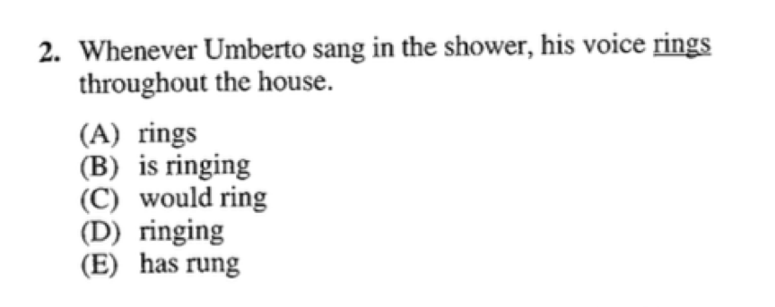

Checkpoint 5 动词相关考点
====
动词性考点是SAT基础语法考察最多、变化最丰富的一部分，相信大家在之前的英语学习中已经有过不少体会。我们将从语态、时态、情态三个角度切入。

501-动词相关考点：语态（主被动）；时态
----
播放器：
<cr type="player" parameters="XMzg1MzUxNjE5Ng=="><notice>播放器功能在此无法正常显示，请移步至[程谱 coderecipe.cn](https://coderecipe.cn/learn/1)查看。</notice></cr>

密码：we12

### 练习：
在横线上填写动词的正确形式

--Iliad is said _____(compose) by Homer.
--Recently, he _____(overwhelm) by his assignments.

正确答案：
<cr type="hidden"><notice>隐藏内容功能在此无法正常显示，请移步至[程谱 coderecipe.cn](https://coderecipe.cn/learn/1)查看。</notice>(to have been composed; has been overwhelmed OR was overwhelmed)</cr>

502-动词相关考点：情态
----
情态部分在新SAT中考察非常少，也相对最难理解，但相信看完视频+习题练习，大家都可以掌握牢固～

播放器：
<cr type="player" parameters="XMzg1MzUxNjc4OA=="><notice>播放器功能在此无法正常显示，请移步至[程谱 coderecipe.cn](https://coderecipe.cn/learn/1)查看。</notice></cr>

密码：er23

### 练习题：

正确答案：
<cr type="hidden"><notice>隐藏内容功能在此无法正常显示，请移步至[程谱 coderecipe.cn](https://coderecipe.cn/learn/1)查看。</notice>(C)</cr>

503-动词相关考点：练习题
----
播放器：
<cr type="player" parameters="XMzg1MzUxODA1Mg=="><notice>播放器功能在此无法正常显示，请移步至[程谱 coderecipe.cn](https://coderecipe.cn/learn/1)查看。</notice></cr>

密码：sd23

动词相关考点 课件：
[链接](https://pan.baidu.com/s/1kxCOgwSuieMH3mk1Zcgbew)   密码:i65y
