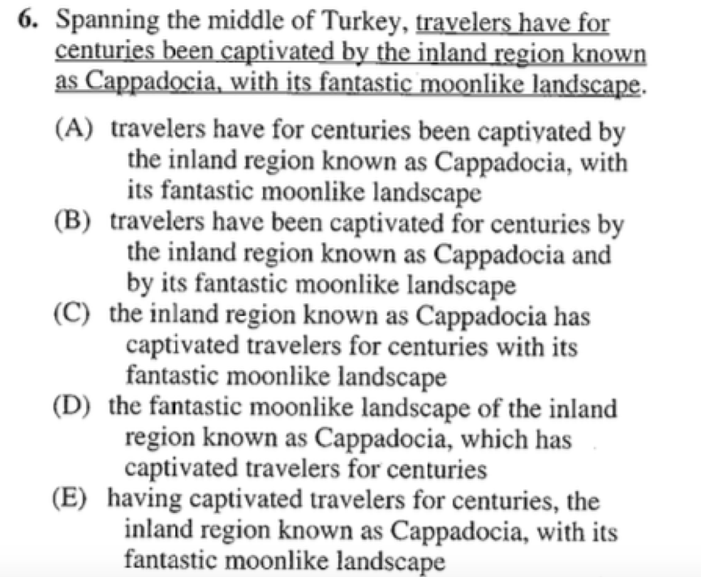
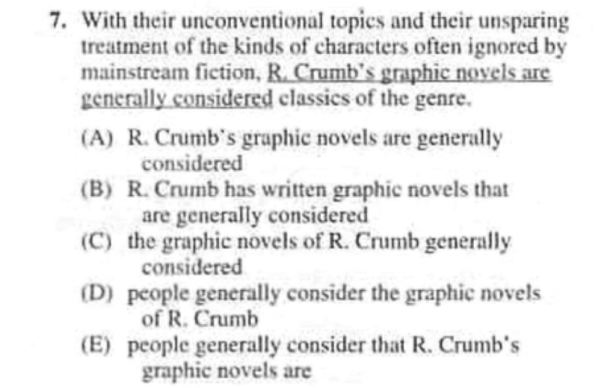
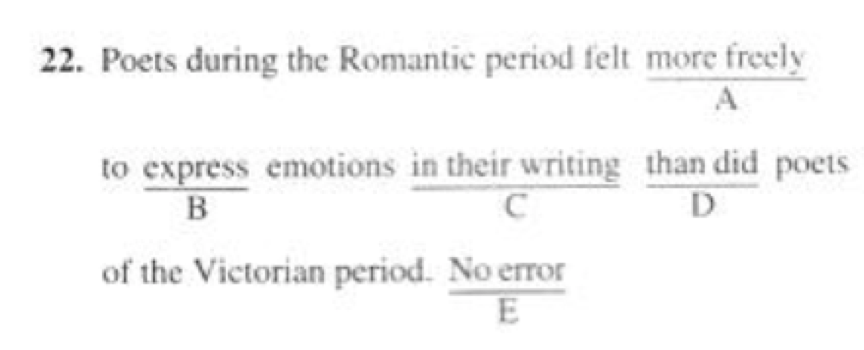

Checkpoint 7 修饰成分
====
在分析长难句时我们往往选择“无视”修饰成分，那么修饰成分都有哪些分类呢？它们在使用中有需要注意哪些问题呢？怎样修饰才最简洁、最清晰？我们一起来看看吧。

701-修饰成分：形容词副词分别的修饰范围；逻辑主语；
----
播放器：
<cr type="player" parameters="XMzg1MzUyNjQ3Mg=="><notice>播放器功能在此无法正常显示，请移步至[程谱 coderecipe.cn](https://coderecipe.cn/learn/1)查看。</notice></cr>

密码：df45

###练习：

正确答案：
<cr type="hidden"><notice>隐藏内容功能在此无法正常显示，请移步至[程谱 coderecipe.cn](https://coderecipe.cn/learn/1)查看。</notice>(C)</cr>

正确答案：
<cr type="hidden"><notice>隐藏内容功能在此无法正常显示，请移步至[程谱 coderecipe.cn](https://coderecipe.cn/learn/1)查看。</notice>(A)</cr>

702-修饰成分：形容词副词练习题
----
播放器：
<cr type="player" parameters="XMzg1MzUzMDU0NA=="><notice>播放器功能在此无法正常显示，请移步至[程谱 coderecipe.cn](https://coderecipe.cn/learn/1)查看。</notice></cr>

密码：rt56

###练习：

正确答案：
<cr type="hidden"><notice>隐藏内容功能在此无法正常显示，请移步至[程谱 coderecipe.cn](https://coderecipe.cn/learn/1)查看。</notice>(A) - more free</cr>

703-修饰成分：逻辑主语练习题
----
播放器：
<cr type="player" parameters="XMzg1MzUzMTU5Mg=="><notice>播放器功能在此无法正常显示，请移步至[程谱 coderecipe.cn](https://coderecipe.cn/learn/1)查看。</notice></cr>

密码：gh12

704-修饰成分：就近修饰
----
播放器：
<cr type="player" parameters="XMzg1MzUzMjc0MA=="><notice>播放器功能在此无法正常显示，请移步至[程谱 coderecipe.cn](https://coderecipe.cn/learn/1)查看。</notice></cr>

密码：yu78

705-修饰成分：就近修饰练习题
----
播放器：
<cr type="player" parameters="XMzg1MzUzMjEyOA=="><notice>播放器功能在此无法正常显示，请移步至[程谱 coderecipe.cn](https://coderecipe.cn/learn/1)查看。</notice></cr>

密码：er34

706-修饰成分：定语从句知识点拓展
----
播放器：
<cr type="player" parameters="XMzg1MzUzNTc4OA=="><notice>播放器功能在此无法正常显示，请移步至[程谱 coderecipe.cn](https://coderecipe.cn/learn/1)查看。</notice></cr>

密码：3533

修饰成分 课件：
[链接](https://pan.baidu.com/s/1BJGj2jUxwKxSuhkCedU_pQ)   密码:nzl1
[链接](https://pan.baidu.com/s/1qcDLAVxR2FGEBPF4NLgBFA)  密码:nyye
