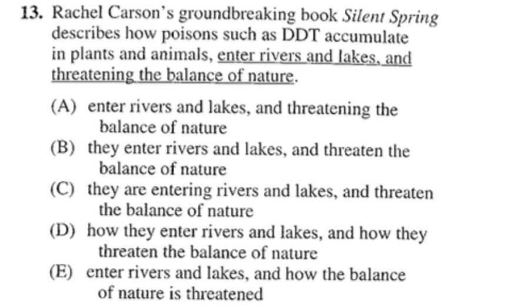
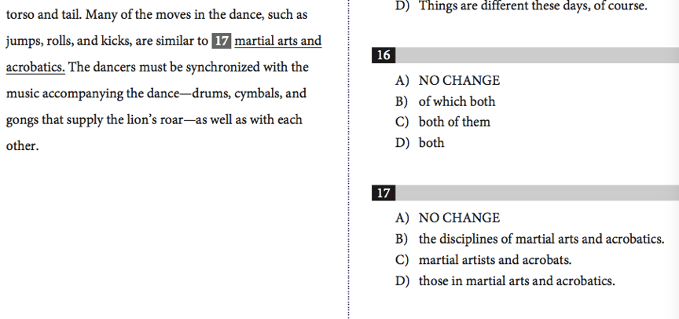

Checkpoint 8 SAT特色考点
====
SAT语法文章十分“偏爱”结构严谨、整齐的语言，平行结构因而成为SAT的一大特色考点；隐藏的比较句型、多层次的比较对象也经常迷惑考生。但同时，这两点也是最容易识别、技巧性最强的部分。

801-SAT特色考点：平行结构&平行练习题
----
播放器：
<cr type="player" parameters="XMzg1MzUzNTc4OA=="><notice>播放器功能在此无法正常显示，请移步至[程谱 coderecipe.cn](https://coderecipe.cn/learn/1)查看。</notice></cr>

密码：bn12

###练习：

正确答案：
<cr type="hidden"><notice>隐藏内容功能在此无法正常显示，请移步至[程谱 coderecipe.cn](https://coderecipe.cn/learn/1)查看。</notice>(D)</cr>

802-SAT特色考点：比较句型
----
播放器：
<cr type="player" parameters="XMzg1MzUzNzI4NA=="><notice>播放器功能在此无法正常显示，请移步至[程谱 coderecipe.cn](https://coderecipe.cn/learn/1)查看。</notice></cr>

密码：yuu4

###练习：

正确答案：
<cr type="hidden"><notice>隐藏内容功能在此无法正常显示，请移步至[程谱 coderecipe.cn](https://coderecipe.cn/learn/1)查看。</notice>(D)</cr>

803-SAT特色考点：比较 练习题
----
播放器：
<cr type="player" parameters="XMzg1MzUzODM5Ng=="><notice>播放器功能在此无法正常显示，请移步至[程谱 coderecipe.cn](https://coderecipe.cn/learn/1)查看。</notice></cr>

密码：ui89

SAT特色考点 课件
[链接](https://pan.baidu.com/s/1Njn9gUdX--Fvfe6cGfcrpQ)   密码:8lvi
