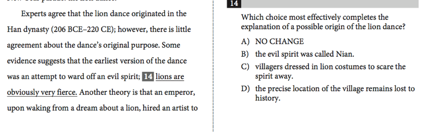
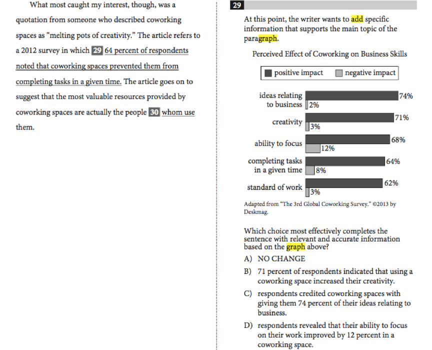
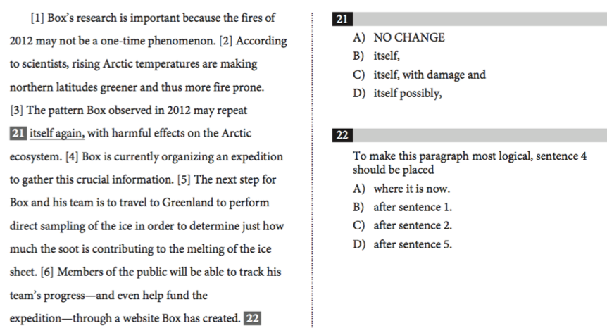
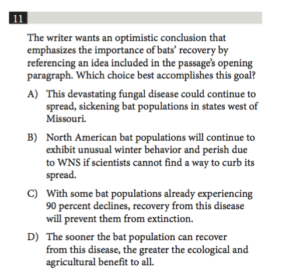
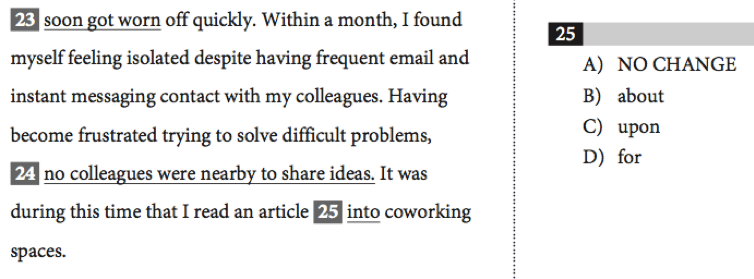
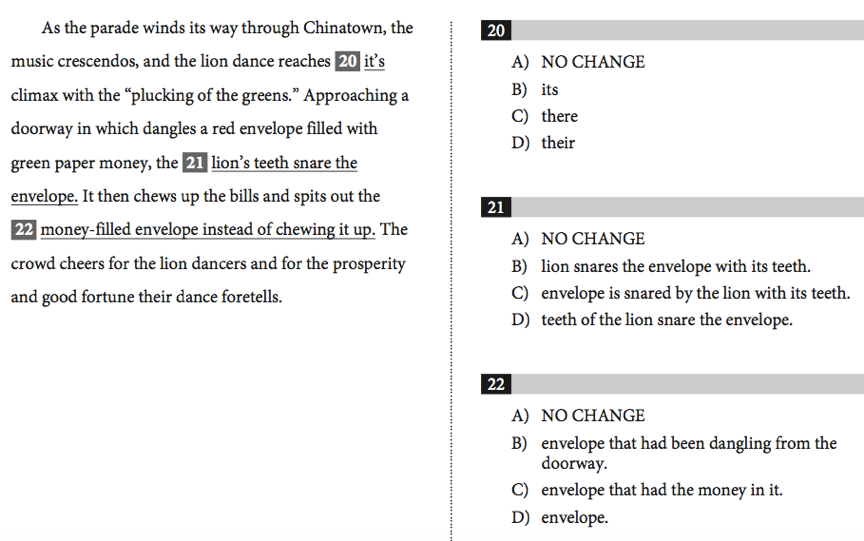
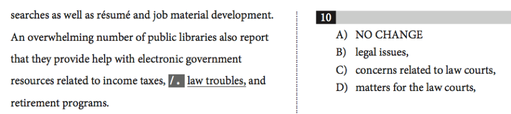
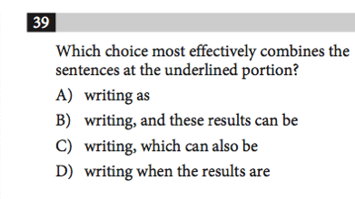

Checkpoint 9 篇章类问题
====
作为SAT考试中的“新秀”，篇章类问题Passage-based questions（Expression of Ideas）已然占据了“半壁江山”，考察考生的学术写作能力——如何结构清晰、逻辑严谨、语言态度正式地介绍事物或者阐述观点。由于大部分篇章题需要在理解全文的基础上做题， 每个知识点之后没有跟进例题，但是在这部分的最后（906&907），我们会一起完成两篇完整考试题，一起体会这些篇章小技巧的具体应用。

901-篇章类问题：文章发展脉络
----
播放器：
<cr type="player" parameters="XMzg1MzUzOTcyOA=="><notice>播放器功能在此无法正常显示，请移步至[程谱 coderecipe.cn](https://coderecipe.cn/learn/1)查看。</notice></cr>

密码：gh34

902-篇章类问题：文章结构
----
播放器：
<cr type="player" parameters="XMzg1MzU0MDQ2NA=="><notice>播放器功能在此无法正常显示，请移步至[程谱 coderecipe.cn](https://coderecipe.cn/learn/1)查看。</notice></cr>

密码：fg45

903-篇章类问题：语言使用要求1—用词准确; 语言简洁(重复题)
----
播放器：
<cr type="player" parameters="XMzg1MzU0ODI1Mg=="><notice>播放器功能在此无法正常显示，请移步至[程谱 coderecipe.cn](https://coderecipe.cn/learn/1)查看。</notice></cr>

密码：hj90

904-篇章类问题：语言使用要求2—风格文体语气
----
播放器：
<cr type="player" parameters="XMzg1MzU0MTU0MA=="><notice>播放器功能在此无法正常显示，请移步至[程谱 coderecipe.cn](https://coderecipe.cn/learn/1)查看。</notice></cr>

密码：hj24

905-篇章类问题：语言使用要求3—上下句衔接
----
播放器：
<cr type="player" parameters="XMzg1MzU0MjEwOA=="><notice>播放器功能在此无法正常显示，请移步至[程谱 coderecipe.cn](https://coderecipe.cn/learn/1)查看。</notice></cr>

密码：bn67

###练习：
判断下面题目是哪种题型：

正确答案：
<cr type="hidden"><notice>隐藏内容功能在此无法正常显示，请移步至[程谱 coderecipe.cn](https://coderecipe.cn/learn/1)查看。</notice>(文章发展脉络—论据细节)</cr>

正确答案：
<cr type="hidden"><notice>隐藏内容功能在此无法正常显示，请移步至[程谱 coderecipe.cn](https://coderecipe.cn/learn/1)查看。</notice>(文章发展脉络—论据细节-图表题)</cr>

正确答案：
<cr type="hidden"><notice>隐藏内容功能在此无法正常显示，请移步至[程谱 coderecipe.cn](https://coderecipe.cn/learn/1)查看。</notice>(文章结构-逻辑顺序)</cr>

正确答案：
<cr type="hidden"><notice>隐藏内容功能在此无法正常显示，请移步至[程谱 coderecipe.cn](https://coderecipe.cn/learn/1)查看。</notice>(文章结构-conclusion)</cr>

正确答案：
<cr type="hidden"><notice>隐藏内容功能在此无法正常显示，请移步至[程谱 coderecipe.cn](https://coderecipe.cn/learn/1)查看。</notice>(语言使用要求—用词准确)</cr>

正确答案：
<cr type="hidden"><notice>隐藏内容功能在此无法正常显示，请移步至[程谱 coderecipe.cn](https://coderecipe.cn/learn/1)查看。</notice>(语言使用要求—语言简洁（重复题）)</cr>

正确答案：
<cr type="hidden"><notice>隐藏内容功能在此无法正常显示，请移步至[程谱 coderecipe.cn](https://coderecipe.cn/learn/1)查看。</notice>(语言使用要求—文体风格语气)</cr>

正确答案：
<cr type="hidden"><notice>隐藏内容功能在此无法正常显示，请移步至[程谱 coderecipe.cn](https://coderecipe.cn/learn/1)查看。</notice>(语言使用要求—上下句衔接（combine题)</cr>

906-篇章类问题：例题1—201701北美Court Reporting: Humans v. Machines
----
播放器：
<cr type="player" parameters="XMzg1MzU2MjI0OA=="><notice>播放器功能在此无法正常显示，请移步至[程谱 coderecipe.cn](https://coderecipe.cn/learn/1)查看。</notice></cr>

密码：kl09

907-篇章类问题：例题2—201701北美Fire in Space
----
[链接](https://pan.baidu.com/s/1wI9rAmaW2YkZvM-UtMJsxg)   密码:881z

篇章类问题 课件：
[链接](https://pan.baidu.com/s/1Qg-VtXKCp4CBAcNGKCXObw)   密码:lhjo

篇章类问题 例题两篇（201701北美两篇）
[链接](https://pan.baidu.com/s/1sWQN2vXHFU3r0bbjkpWObg)   密码:z8tm